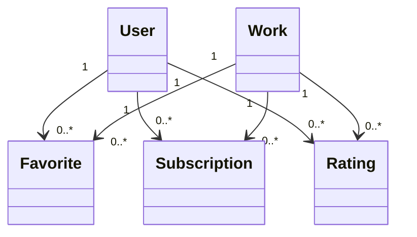

# Example: Anime favorite and notification

## Frame

目的: アニメSNSにおける作品のお気に入り、通知、評価の責任と関係を決める。

## n1

- User owns Favorite
- Favorite points to Work
- Favorite includes notification settings
- User rates Work

## Challenge

「お気に入りを解除しても放送通知だけ受け取りたいユーザーはいるか？」

回答がYesなら、通知購読はFavoriteの単なる属性ではない。

## n2

## Highlight

- FavoriteとSubscriptionを分離
- 理由: 開始・終了条件とユーザー意図が異なる
- 未確認: Favorite作成時にSubscriptionを自動生成するか

## Pattern candidate

`Lifecycle Split`: 同じUI操作から生成されても、独立して変更・終了できる関心は別概念として扱う。
